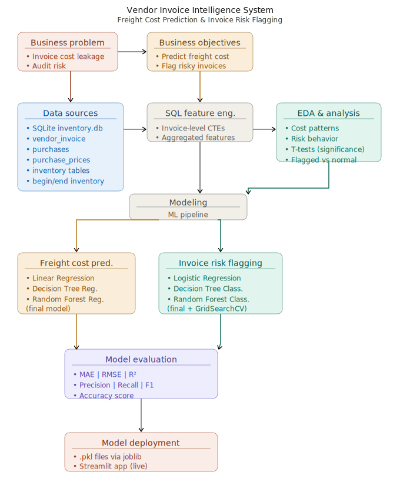

# 🧾 Vendor Invoice Intelligence System
### AI-Driven Freight Cost Prediction & Invoice Risk Flagging

[](https://vendor-invoice-intelligence-rs5y9atfz7j2hxy9pzc2app.streamlit.app/)
[](https://www.python.org/)
[](https://scikit-learn.org/)
[](https://opensource.org/licenses/MIT)


---

##  Live Demo
 **[Click here to open the app](https://vendor-invoice-intelligence-rs5y9atfz7j2hxy9pzc2app.streamlit.app/)**

---

##  Project Overview

This is an end-to-end machine learning project built to solve two real-world business problems in supply chain finance:

| Problem | Solution |
|---|---|
|  Freight cost overruns & vendor overcharging | **Freight Cost Prediction** using Random Forest Regressor |
|  Risky or fraudulent vendor invoices going undetected | **Invoice Risk Flagging** using Random Forest Classifier |

---

##  Project Architecture



---

##  Models Used

###  Freight Cost Prediction (Regression)
| Model | Purpose |
|---|---|
| Linear Regression | Baseline |
| Decision Tree Regressor | Intermediate |
| **Random Forest Regressor** |  Final Model |

###  Invoice Risk Flagging (Classification)
| Model | Accuracy | Flagged F1 |
|---|---|---|
| Logistic Regression | 65% | 0.00  |
| Decision Tree | 95% | 0.92  |
| **Random Forest + GridSearchCV** | **96%** | **0.93**  |

> Hyperparameter tuning performed using **GridSearchCV** with **F1-score** to handle class imbalance.

---

## 📊 Evaluation Metrics

### Invoice Risk Flagging — Random Forest (Best Model)
```
              precision    recall  f1-score   support
      Normal       0.94      1.00      0.97       725
     Flagged       1.00      0.87      0.93       384
    accuracy                           0.96      1109
```

### Feature Importance
| Feature | Importance |
|---|---|
| avg_receiving_delay | 30.4% |
| total_item_dollars | 20.6% |
| total_item_quantity | 15.3% |
| invoice_quantity | 10.7% |
| Freight | 10.3% |
| invoice_dollars | 10.1% |
| days_po_to_invoice | 2.6% |

---

##  Project Structure

```
vendor-invoice-intelligence/
│
├── app.py                          ← Streamlit web app (entry point)
├── requirements.txt                ← Python dependencies
├── .gitignore
│
├── assets/                         ← Images & diagrams for README
│   └── architecture.svg
│
├── inference/                      ← Run predictions on new data
│   ├── predict_freight.py          ← Freight cost inference
│   └── predict_invoice_flag.py     ← Invoice risk inference
│
├── invoice_flagging/               ← Invoice risk classification pipeline
│   ├── data_preprocessing.py       ← SQL loading, labeling, scaling
│   ├── model_evaluation.py         ← Training & evaluation functions
│   └── train.py                    ← Main training script
│
├── freight_cost_prediction/        ← Freight cost regression pipeline
│   ├── data_preprocessing.py       ← SQL loading, feature prep
│   ├── model_evaluation.py         ← Training & evaluation functions
│   └── train.py                    ← Main training script
│
├── models/                         ← Serialized trained models
│   ├── random_forest.pkl           ← Invoice flagging model
│   ├── best_model.pkl              ← Freight prediction model
│   └── scaler.pkl                  ← Feature scaler
│
├── data/                           ← Database (not included, 404MB)
│   └── inventory.db
│
└── notebooks/                      ← EDA & experimentation notebooks
```

---

##  How to Run Locally

### 1. Clone the repo
```bash
git clone https://github.com/Soumyajit2819/vendor-invoice-intelligence.git
cd vendor-invoice-intelligence
```

### 2. Install dependencies
```bash
pip install -r requirements.txt
```

### 3. Add your database
Place your `inventory.db` file in the `data/` folder:
```
data/inventory.db
```

### 4. Train the models (optional — pkl files already included)
```bash
python invoice_flagging/train.py
python freight_cost_prediction/train.py
```

### 5. Run the app
```bash
streamlit run app.py
```

---

##  Data

The full `inventory.db` database is not included in this repo due to file size (404MB).

| Table | Description |
|---|---|
| `vendor_invoice` | Invoice-level financial and timing data |
| `purchases` | Item-level purchase details |
| `purchase_prices` | Reference purchase prices |
| `inventory tables` | Begin and end inventory snapshots |

> SQL aggregation via CTEs is used to generate invoice-level features for modeling.

---

##  Exploratory Data Analysis

EDA focused on business-driven questions:
- Do flagged invoices have higher financial exposure?
- Does freight scale linearly with quantity?
- Does freight cost depend on quantity?

Statistical **t-tests** confirmed that flagged invoices differ meaningfully from normal invoices across key metrics.

---

##  Tech Stack

| Tool | Usage |
|---|---|
| Python 3.11 | Core language |
| pandas & numpy | Data manipulation |
| scikit-learn | ML modeling |
| SQLite + SQL | Data storage & feature engineering |
| joblib | Model serialization |
| Streamlit | Web application |
| GitHub | Version control |
| Streamlit Cloud | Deployment |

---
